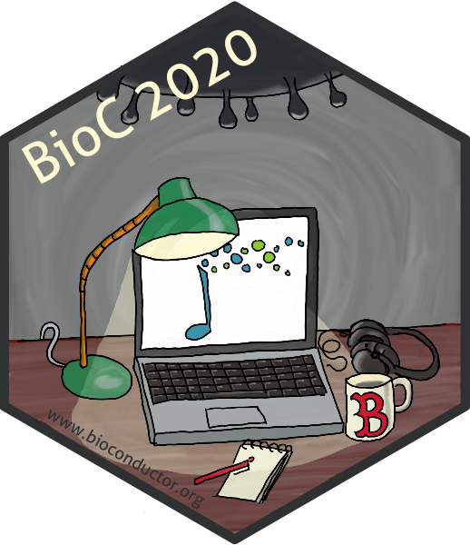

layout: true

<div class="my-header"></div>

<div class="my-footer"><span>
Bioconductor 2020
&emsp;&emsp;&emsp;&emsp;
Reproducible environments for integrated computational workflows
</span></div>

```{r setup, include=FALSE}
stopifnot(require(htmltools))
stopifnot(require(RefManageR))
stopifnot(require(knitr))
```

```{r htmltools, include=FALSE}
stopifnot(requireNamespace("htmltools"))
htmltools::tagList(rmarkdown::html_dependency_font_awesome())
```

```{r, load_refs, include=FALSE, cache=FALSE}
options(htmltools.dir.version = FALSE)
BibOptions(
  check.entries = FALSE,
  bib.style = "authoryear",
  cite.style = "authoryear",
  max.names = 2,
  style = "markdown",
  hyperlink = "to.doc",
  dashed = TRUE)
bib <- ReadBib("references.bib")
```

---

# Structure of the session

.pull-left[
## What

<i class="far fa-clock"></i>
This session is 55 minutes.

<i class="fas fa-info-circle"></i>
A handful of introduction slides.

  + Workflow managers
  
  + Environment managers

<i class="fas fa-volume-up"></i>
Open discussion

  + Your preferences
  
  + Best practices
  
  + Feature requests
]

.pull-right[
## How

<i class="far fa-comment-alt"></i>
Text chat (on the right)

<i class="fas fa-chart-bar"></i>
Polls (on the right)

<i class="fas fa-microphone"></i>
Message in the chat, or raise your hand:
we'll pass the (virtual) mic in turn!

<i class="fab fa-google-drive"></i>
Take notes on this collaborative
[Google Docs](https://docs.google.com/document/d/1ok2H9HVoa8c-m-VcwdQM0ccOuMTmESKCzaaWHb6trwE/edit?usp=sharing)
during the session!
]

---

# Reproducible workflows and environments

## Why do we care?

> The bio.tools registry of life science software tools includes over 17,000 entries from more than 1,000 contributors `r Citep(bib, "mark2020pipelines")`.

- We all write workflows that combine many of those tools to process and analyze data.

  + e.g., ChIP-seq, scRNA-seq, RNA-seq, proteomics

- For full reproducibility, collaboration and teaching relies on the capacity to share:

  + Code
  
  + Environment(s) (software dependencies and versions)
  
  + Input data (e.g., raw data, annotations)

---

# Workflow managers

.pull-left[
## Examples

<a href="https://www.nextflow.io/"></a>
<a href="https://nf-co.re/"></a>

<a href="https://snakemake.readthedocs.io/en/stable/#"></a>

<a href="http://www.ruffus.org.uk/"></a>
<a href="https://github.com/cgat-developers"></a>
<a href="https://github.com/cgat-developers/cgat-core"></a>

<a href="https://bioconductor.org/packages/systemPipeR/"></a>
<a href="https://docs.ropensci.org/drake/"></a>

## No logo ...

`r BiocStyle::Biocpkg('Rcwl')`
]

.pull-right[
## Features

<i class="far fa-thumbs-up"></i> Versioned workflows

<i class="far fa-thumbs-up"></i> HPC queue managers (e.g., DRMAA)

<i class="far fa-thumbs-up"></i> Containerized environments

<i class="far fa-thumbs-up"></i> Conda environments

<i class="far fa-thumbs-up"></i> Parallelisation
]

.center[
What is _your_ favorite?
]

---

# Software environments

> A solution, says Boutros, chosen by the Dialogue on Reverse-Engineering Assessment and Methods (DREAM) challenges for genomics tools, is to predefine the input and output and to require containerized software solutions `r Citep(bib, "mark2020pipelines")`.

---

# References

.small-p[
```{r, include=TRUE, echo=FALSE, results="asis"}
PrintBibliography(bib)
```
]
